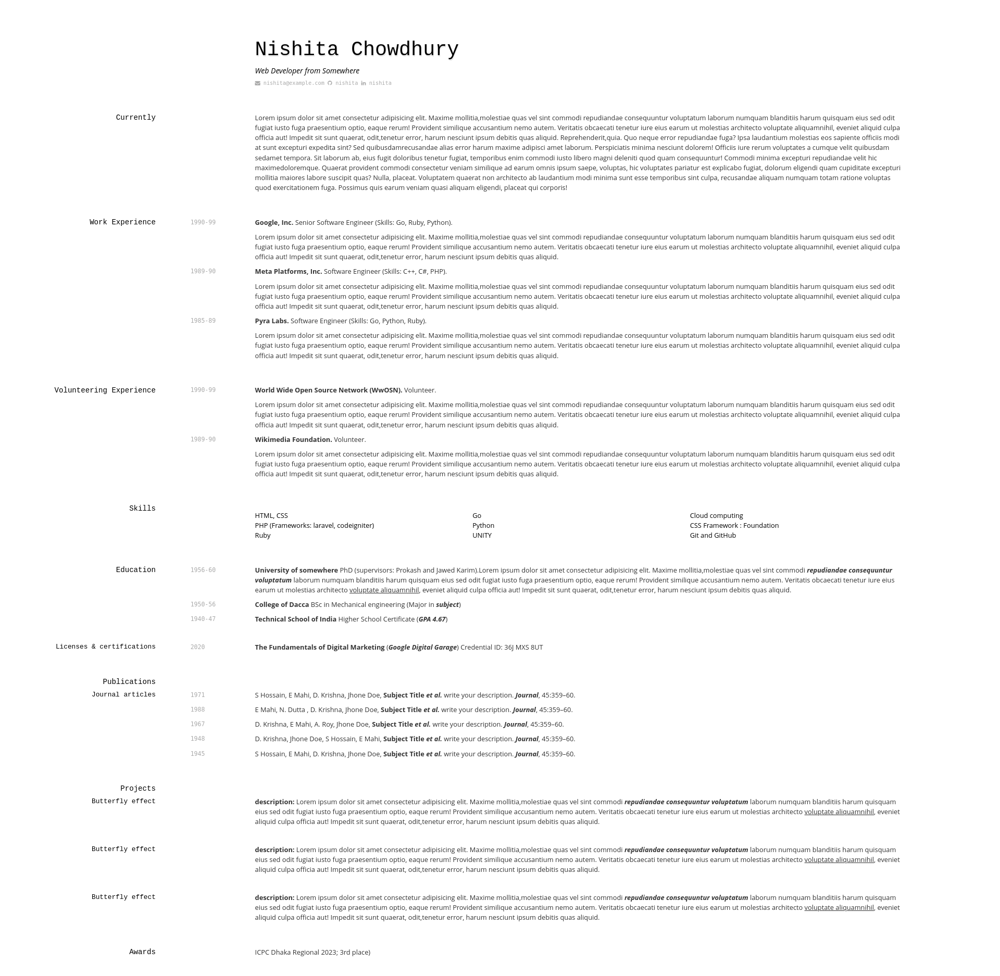

# Jekyll Vitae

**Jekyll Vitae** is a Jekyll theme to host resume / CV based on Markdown. It's easy to create your resume/CV using this theme.

, It's easy to use, easty to customize and it has lot of benefits.

- You don't need to use command line
- You don't need to install/configure ruby, rvm/rbenv, ruby gems 

You can set it up in just a few minutes. Then you can configure and customize your theme and you can create a Amazing Resume.



## Quick Start

### Step 1) Fork Jekyll Vitae 

Fork this repo, then Go to settings and set master branch as Github Pages source. Now, Your **Jekyll Vitae** should be ready at `https://<username>.github.io/jekyll-vitae/`


### Step 2) Customize and configure

Edit `_config.yml` (customize whatever you want) . After editing, Your site will be viewable at `https://<username>.github.io/jekyll-vitae/`


### Step 3) Edit Markdown file

Edit `/Index.md` to create your resume. Write in Markdown language in this file about yourself, about your skills, experience and whatever you want.


## Local Development

1. If you want to use it locally, you should clone this repository then just like deploying a regular Jekyll website
```sh
git clone https://github.com/sakhsain/jekyll-vitae.git
```

2. Commit any changes and push everything to the master branch of your GitHub repository. GitHub Page will then deploy your repository to site and it's will be viewable.

  

## Questions?

[Open an Issue](https://github.com/sakhsain/jekyll-vitae/issues/new) and let's chat!


## Credits

- [Jekyll](https://github.com/jekyll/jekyll) - Thanks to its creators, contributors and maintainers.
- [Benjamin L. Moore](https://github.com/blmoore/) - Thanks for creating [md-cv](https://github.com/blmoore/md-cv)
- [meyerweb.com](http://meyerweb.com/) - Thanks for creating the stylesheets.

## Contributing

Interested in contributing to Jekyll Vitae? I'd love your help. Jekyll Vitae is an open source project, so you can contribute to the project. It's easy to contribute, just fork the repo then making any change. At last, open a pull request and wait for few hours. After, revewing your pull request; I will merge your proposed changes into the project. So, don't late, open your computer quickly and [Open an Issue](https://github.com/sakhsain/jekyll-vitae/issues/new)!
